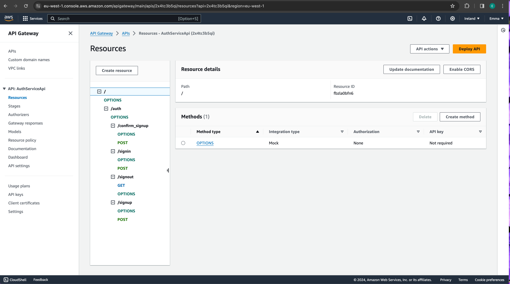
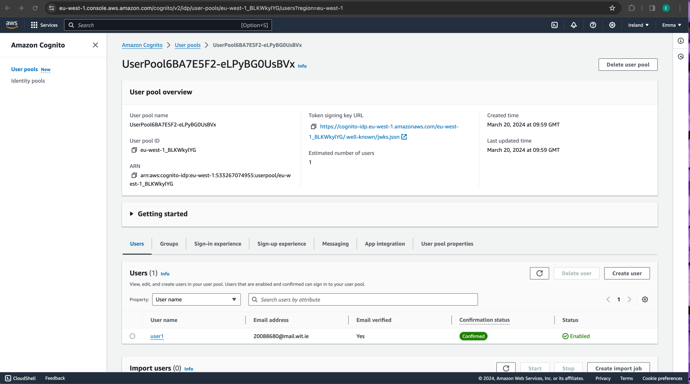

## Serverless REST Assignment.

__Name:__ Emma Roche

__Video demonstration:__ [Demo Link](https://youtu.be/H9eK2kiACVw)

This repository contains an implementation of a serverless REST API for the AWS platform. The CDK framework is used to provision its infrastructure. The API's domain context is movie reviews.

### API endpoints.

Below is a list of the app's endpoints (excluding the Auth API endpoints) that have been implemented: 

+ POST /movies/reviews - add a movie review.
+ GET /movies/{movieId}/reviews - Get all the reviews for the specified movie.
+ GET /movies/{movieId}/reviews?minRating=n - Get the reviews for the specified movie with a rating greater than the minRating.
+ GET /movies/{movieId}/reviews/{reviewerName} - Get the review written by the named reviewer for the specified movie.
+ PUT /movies/{movieId}/reviews/{reviewerName} - Update the text of a review.
+ GET /movies/{movieId}/reviews/{year} - Get the reviews written in a specific year for a specific movie.
+ GET /reviews/{reviewerName} - Get all the reviews written by a specific reviewer.
+ GET /reviews/{reviewerName}/{movieId}/translation?language=code - Get a translated version of a movie review using the movie ID and reviewer name as the identifier.

#### AppApi Endpoints from the AWS management console (API Gateway service):

AppApi Endpoints Continued

#### AuthServiceApi Endpoints from the AWS management console (API Gateway service):

### Authentication

Below is a screenshot from the AWS management console (Cognito User Pools) showing my confirmed user account.

### Independent learning 

I did some independent learning and research for:

+ The PUT /movies/{movieId}/reviews/{reviewerName} endpoint (file name: updateMovieReview.ts) 

  **Note:** I used some existing code from the labs but I also looked at some online resources to help me get this to work successfully.

+ The GET /movies/{movieId}/reviews?minRating=n endpoint (file name: getMovieReviews.ts)

  **Note:**: I used some existing code from the labs but, similar to the last point, I also looked at some online resources to help me get this to work successfully.

+ The GET /reviews/{reviewerName}/{movieId}/translation?language=code (file name: getTranslatedMovieReview.ts and app-api.ts)

   **Note:** I first tried to follow a YouTube video that was linked to us but it did not work successfully within the project. So for the most part, I reused a lot of the lab code along with some new translate code added from online resources that I looked at. However, after running into some role errors, I realised I had to add a new IAM role with the AWSLambdaBasicExecutionRole and TranslateReadOnly policies included called 'translate' and link it to the getTranslatedMovieReviewFn function.

I inserted comments above the relevant code, providing links to the online resources I used as guides during the development of this assignment.

